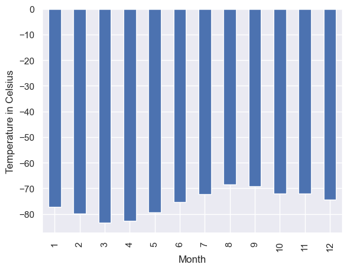
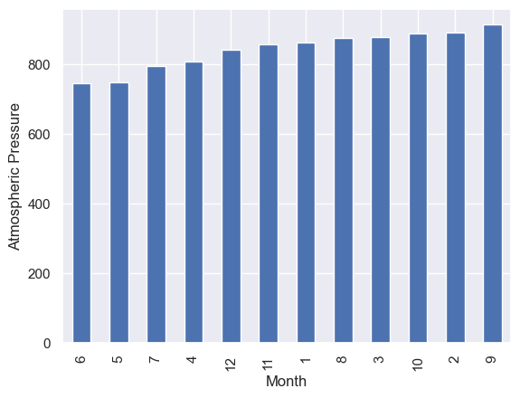
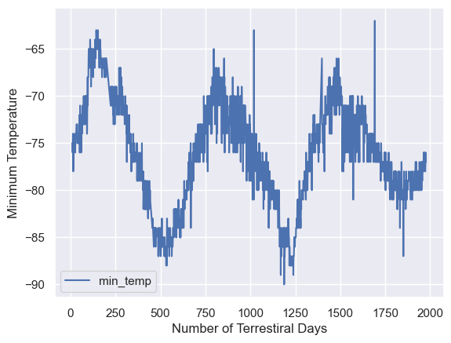

# Web-Scraping Challenge
Making use of Beautiful Soup and Splinter Libraries For Data Scraping

## Mar News
The goal here was to web-scrap data from the [Mars news site](https://static.bc-edx.com/data/web/mars_news/index.html) in order to extract current news article titles and summaries, then store them in a list of dictionaries. See the output below.

``` python
[{'title': "NASA's MAVEN Observes Martian Light Show Caused by Major Solar "
           'Storm',
  'preview': 'For the first time in its eight years orbiting Mars, NASA’s '
             'MAVEN mission witnessed two different types of ultraviolet '
             'aurorae simultaneously, the result of solar storms that began on '
             'Aug. 27.'},
 {'title': "NASA Prepares to Say 'Farewell' to InSight Spacecraft",
  'preview': 'A closer look at what goes into wrapping up the mission as the '
             'spacecraft’s power supply continues to dwindle.'},
 {'title': 'NASA and ESA Agree on Next Steps to Return Mars Samples to Earth',
  'preview': 'The agency’s Perseverance rover will establish the first sample '
             'depot on Mars.'},
 {'title': "NASA's InSight Lander Detects Stunning Meteoroid Impact on Mars",
  'preview': 'The agency’s lander felt the ground shake during the impact '
             'while cameras aboard the Mars Reconnaissance Orbiter spotted the '
             'yawning new crater from space.'},
 {'title': 'NASA To Host Briefing on InSight, Mars Reconnaissance Orbiter '
           'Findings',
  'preview': 'Scientists from two Mars missions will discuss how they combined '
             'images and data for a major finding on the Red Planet.'},
 {'title': 'Why NASA Is Trying To Crash Land on Mars',
  'preview': 'Like a car’s crumple zone, the experimental SHIELD lander is '
             'designed to absorb a hard impact.'},
 {'title': 'Curiosity Mars Rover Reaches Long-Awaited Salty Region',
  'preview': 'After years of climbing, the Mars rover has arrived at a special '
             'region believed to have formed as Mars’ climate was drying.'},
 {'title': 'Mars Mission Shields Up for Tests',
  'preview': 'Protecting Mars Sample Return spacecraft from micrometeorites '
             'requires high-caliber work.'},
 {'title': "NASA's InSight Waits Out Dust Storm",
  'preview': 'InSight’s team is taking steps to help the solar-powered lander '
             'continue operating for as long as possible.'},
 {'title': "NASA's InSight 'Hears' Its First Meteoroid Impacts on Mars",
  'preview': 'The Mars lander’s seismometer has picked up vibrations from four '
             'separate impacts in the past two years.'},
 {'title': "NASA's Perseverance Rover Investigates Geologically Rich Mars "
           'Terrain',
  'preview': 'The latest findings provide greater detail on a region of the '
             'Red Planet that has a watery past and is yielding promising '
             'samples for the NASA-ESA Mars Sample Return campaign.'},
 {'title': 'NASA to Host Briefing on Perseverance Mars Rover Mission '
           'Operations',
  'preview': 'Members of the mission will discuss the rover’s activities as it '
             'gathers samples in an ancient river delta.'},
 {'title': "NASA's Perseverance Makes New Discoveries in Mars' Jezero Crater",
  'preview': 'The rover found that Jezero Crater’s floor is made up of '
             'volcanic rocks that have interacted with water.'},
 {'title': "10 Years Since Landing, NASA's Curiosity Mars Rover Still Has "
           'Drive',
  'preview': 'Despite signs of wear, the intrepid spacecraft is about to start '
             'an exciting new chapter of its mission as it climbs a Martian '
             'mountain.'},
 {'title': "SAM's Top 5 Discoveries Aboard NASA's Curiosity Rover at Mars",
  'preview': '“Selfie” of the Curiosity rover with inset showing the SAM '
             'instrument prior to installation on the rover.'}]
```

## Mar's Weather
Weather data was scraped using the BeautifulSoup library from [this site](https://static.bc-edx.com/data/web/mars_facts/temperature.html). Here are a few representative plots for the average monthly temperature and pressure over a period of approximately 5.5 Earth years (~3 Mars years).







  
